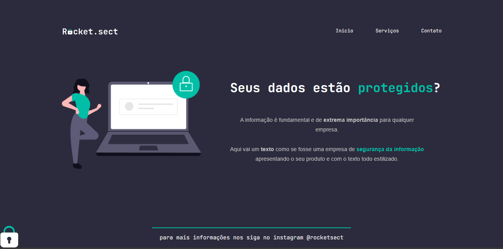

<h1 align="center">Desafio 02 - Rocketseat</h1>

desafio proposto pela rocketseat para o uso que que foi ensinado durante as aulas, nesta aplicação usamos o conhecimento de flex para distribuir os itens na tela da mesma forma que o design no figma.

 <a href="https://lucasspor.github.io/desafio-rocketseat-02/" target="_blank">Github Pages</a>

## 🚀 Tecnologias:

- HTML
- CSS