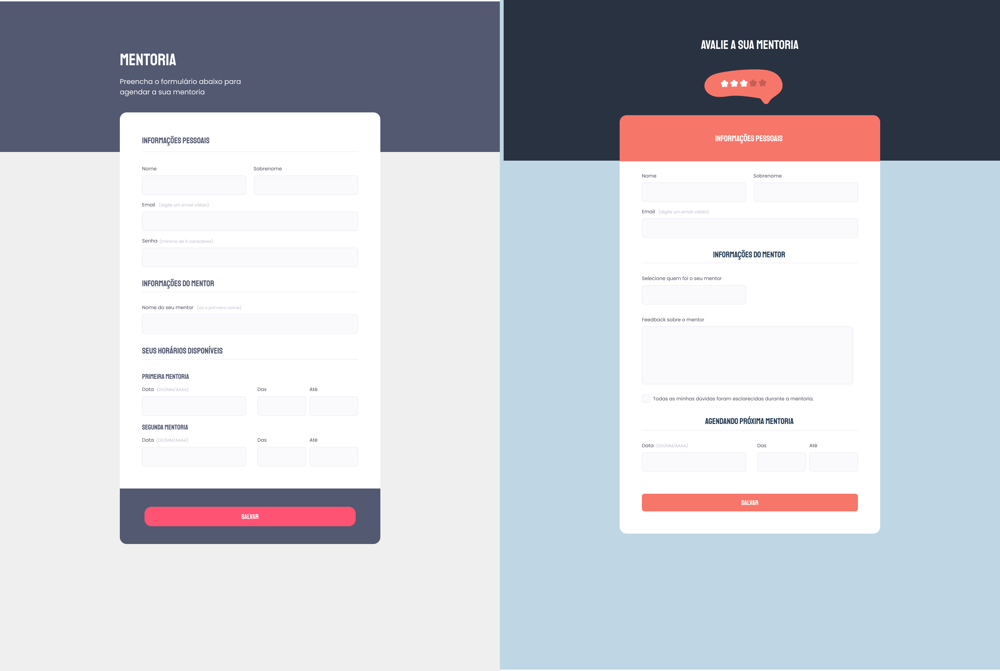

<h1 align="center">Form avaliação tutor</h1>

Neste desafio usando os conhecimentos aplicados no projeto 3 de forms desenvolvemos uma formulario de avaliação de tutor e de pedido para um tutor de ensino.

<a href="https://lucasspor.github.io/desafio-rocketseat-03/" target="_blank"> Github Pages </a>

## 🚀 Tecnologia

- HTML
- CSS