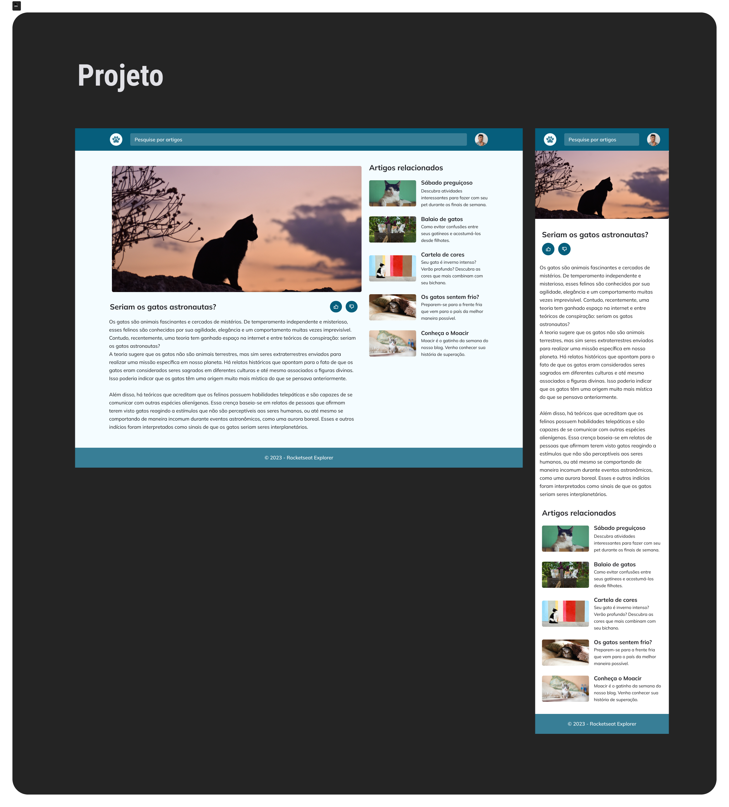

<h1 align="center">Blog de gatos</h1>

Neste desafio usamos todos os conhecimentos aplicados neste curso para construir um blog de gatos, apliquei conhecimentos de responsividade para que pudesse ser visto em diveros aparelhos 

<a href="https://lucasspor.github.io/Rocketseat_Explorer/HTML_CSS/Desafios/04_CatBlog" target="_blank"> Github Pages </a>

## 🚀 Tecnologia

- HTML
- CSS
- Unsplash API