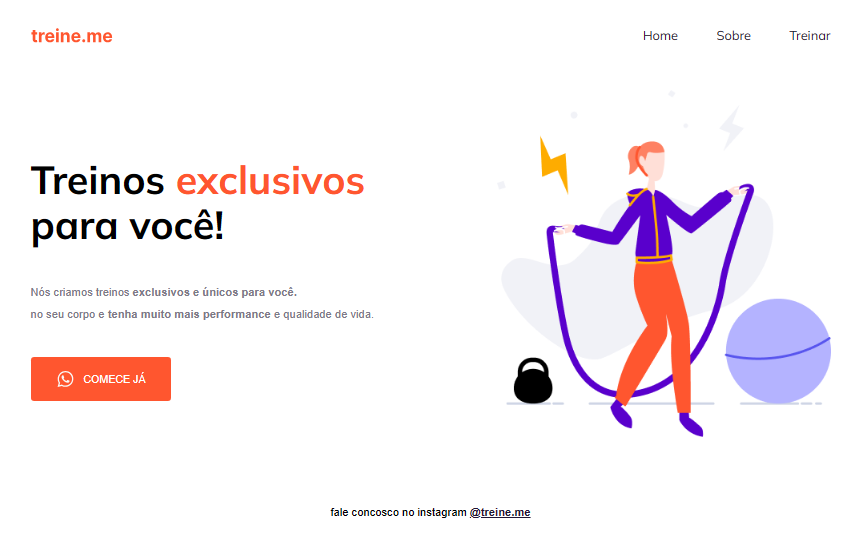

<h1 align="center" >Treine.me</h1>

Projeto densenvolvido com a rocketseat para o curso explorer usando os conhecimento de flexbox para posicionamento dos itens 

<a href="https://lucasspor.github.io/projeto-02/" target="_blank">Github pages</a>

## 🚀 Tecnologias:

- HTML
- CSS
