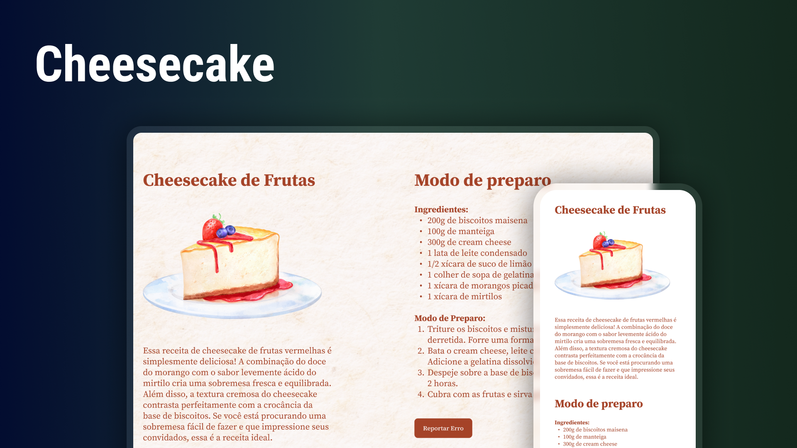

<h1>Cheesecake</h1>

Projeto desenvolvido com a rocketaseat com intuito de consolidar conhecimentos de flexbox e resposividade.

<a href="https://lucasspor.github.io/projeto-05/" target="_blank">Github Pages</a>

## 🚀 Tecnologias

- HTML
- CSS