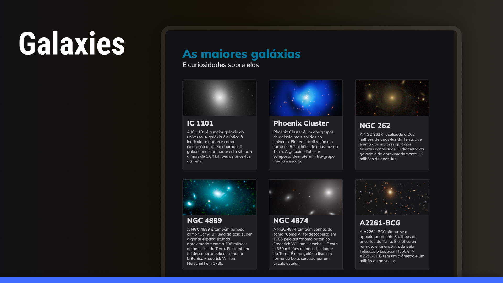

<h1 align="center">Galaxies</h1>

Projeto usando grid para o posicionamento na pagina com relação ao design proposto.

<a href="https://lucasspor.github.io/projeto-06/" target="_blank" >Github pages</a>

## 🚀 Tecnologias

- HTML
- CSS