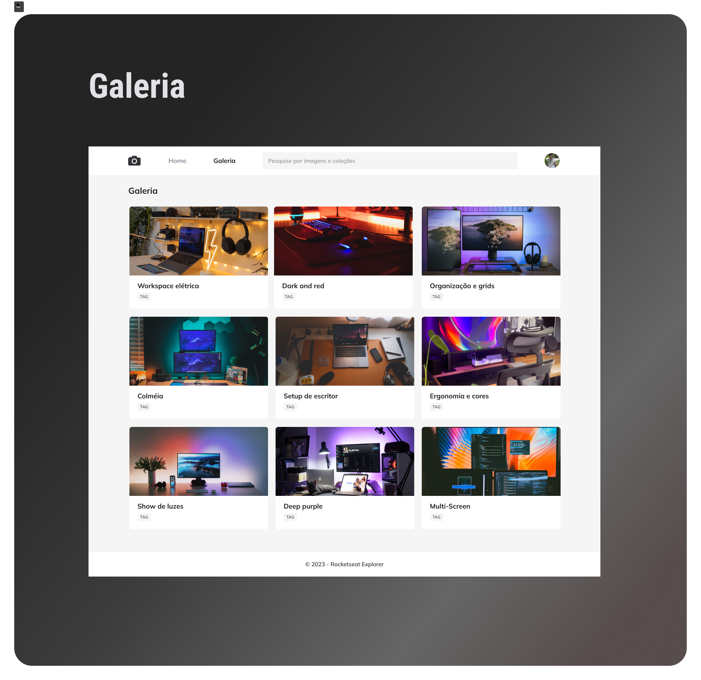

<h1 align="center">Galeria</h1>

Projeto usando os conhecimentos em responsividade para gerar uma galeria de imagens que seja responsiva para outros dispositivos

<a href="https://lucasspor.github.io/Rocketseat_Explorer/HTML_CSS/Projetos/07_Galeria" target="_blank" >Github pages</a>

## 🚀 Tecnologias

- HTML
- CSS
- Unsplash