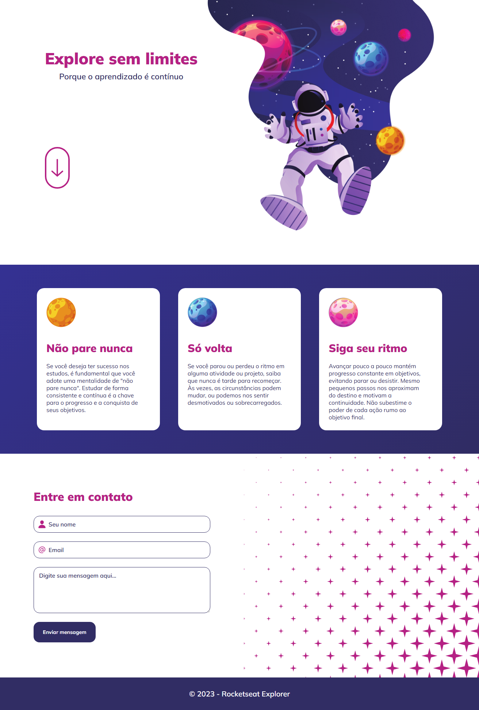

<h1 align="center">Explore sem limites</h1>

Projeto Feito com o intuito de treinar todos os conceitos mostrados durante as aulas tanto conceitos de responsividade quando conceitos de acessibilidade.

<a href="https://lucasspor.github.io/Rocketseat_Explorer/Intensvao/01_HTML_CSS" target="_blank" >Github pages</a>

## 🚀 Tecnologias

- HTML
- CSS
- Figma