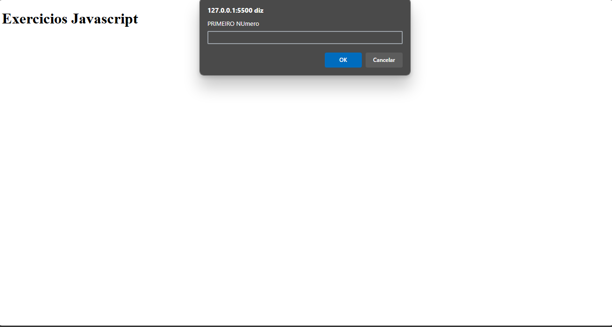

<h1 align="center">Intensivão javascript</h1>

Exercicios intensivos para focar em conhecimentos basicos de javascript, passando por extrutura de condição e repetição e usando o alert(), para aparecimento das condições

<a href="https://lucasspor.github.io/Rocketseat_Explorer/Intensvao/02_Javascript" target="_blank" >Github pages</a>

## 🚀 Tecnologias

- Javascript
- HTML
- CSS